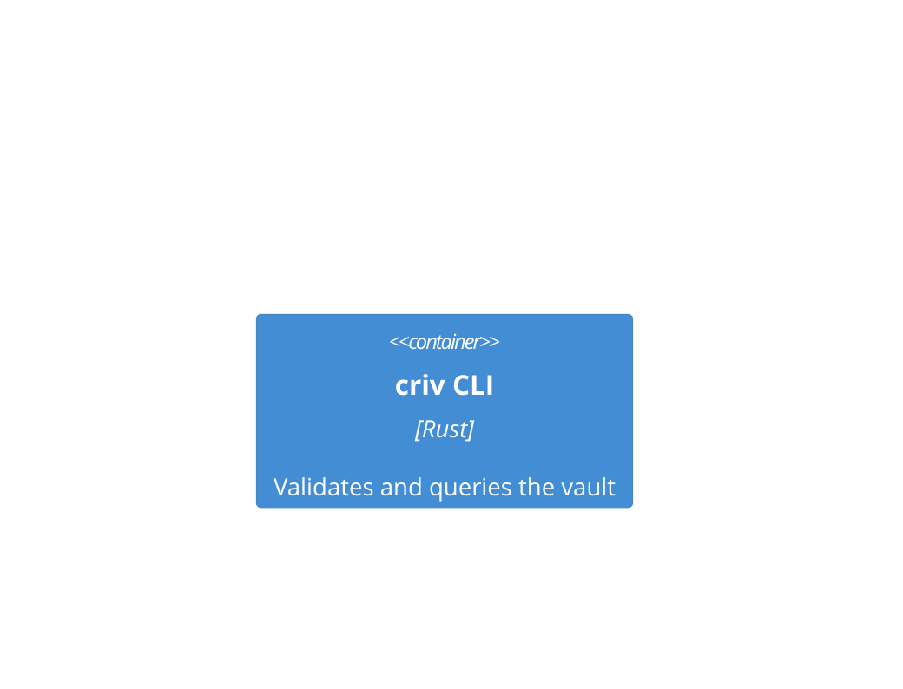

# Mermaid C4 Diagrams As Vault Content

## Context

criv already treats Markdown notes, ADRs, wiki-links, frontmatter targets, and
generated state as one validated repository graph, as established by
[[0002-docs-and-adrs-form-the-governance-graph|ADR-0002]] and
[[0007-content-addressed-state-and-diffing|ADR-0007]]. Users also need diagrams
that explain system context, containers, and components without creating another
format, renderer dependency, or drift-prone sidecar file.

Mermaid C4 diagrams are already renderable in GitHub and Obsidian when authored
as fenced `mermaid` blocks. The missing criv behavior is validation: a diagram
element that claims to represent code should drift when the source file or symbol
is renamed or deleted, just like source wiki-links and `targets.symbols` do
today.

## Decision

Treat Mermaid `C4Context`, `C4Container`, and `C4Component` fenced code blocks
inside note bodies as vault content parsed by `src/c4.rs` and attached to
notes by `src/vault.rs`.

Diagram elements may carry one source anchor through a Mermaid comment placed
immediately after the element declaration:

The annotation keyword is `criv:source` because it resolves only through
`Vault::resolve_source_target` in `src/vault.rs` and v1 permits exactly one
source target per element. Multiple source annotations for one element are an
error reported by `src/check.rs` as `duplicate-c4-source`. Elements without a
source annotation remain valid and simply do not produce source-reference graph
edges.

Validation is intentionally structural and narrow:

- duplicate element aliases are errors;
- relationships whose endpoints do not resolve to declared aliases are errors;
- `criv:source` annotations whose file or symbol does not resolve are errors;
- Mermaid style/layout helpers and unknown macros are ignored by criv.

criv does not render Mermaid, enforce C4 nesting semantics, or maintain a full
Mermaid grammar. GitHub and Obsidian remain the rendering path.

The C4 Code level is generated, not hand-authored. `criv query c4-code <glob>`
in `src/query.rs` emits a pasteable Mermaid `classDiagram` from the source
graph in `src/source_graph.rs`, including in-scope symbols and in-scope call
edges. `criv query c4-elements <note-id>` lists parsed diagram elements and
source resolution status.

Generated state remains additive: src/state.rs writes `c4-context`,
`c4-container`, and `c4-component` nodes, `contains` edges from notes to
elements, `references` edges from annotated elements to resolved code nodes, and
`relates` edges for Mermaid relationships. `STATE_SCHEMA` is unchanged.

## Consequences

Docs and ADRs can include C4 diagrams without introducing a new file type,
frontmatter schema, directory convention, renderer, or service dependency.

Diagram drift becomes visible through the same local CLI workflow as existing
source references. Hook and CI behavior can keep relying on `criv check`; no new
`enforce.rs` stage logic is required for v1.

The `%% criv:source` convention is criv-specific and must be documented for
authors and agents. It is inert to Mermaid renderers because it is a comment.

Because criv stores C4 macro names as raw strings instead of a closed enum, a
misspelled Mermaid macro is ignored or left for the Mermaid renderer to reject.
This avoids tracking Mermaid's experimental C4 macro set inside criv.
