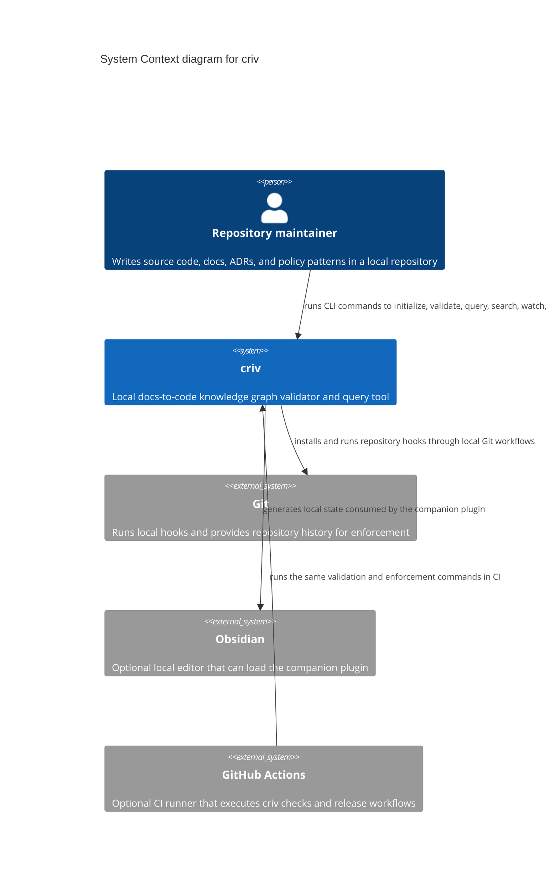

# criv System Context Architecture

This C4 Level 1 view shows `criv` as a local software system used by repository
maintainers and integrated with local Git, optional Obsidian editing, and
optional GitHub Actions workflows.

