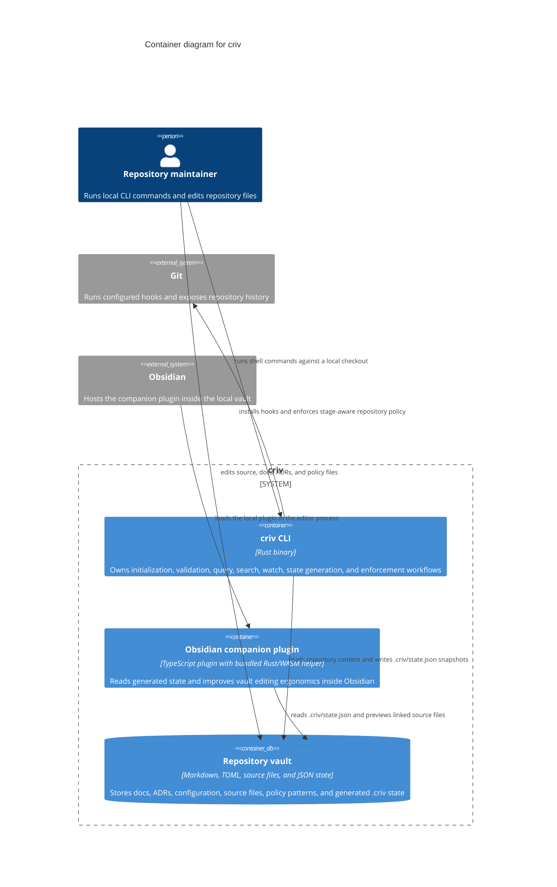

# criv Container Architecture

This C4 Level 2 view shows the runtime containers inside the `criv` software
system: the Rust CLI, the optional Obsidian companion plugin, and the repository
vault that stores source, docs, configuration, and generated state.

