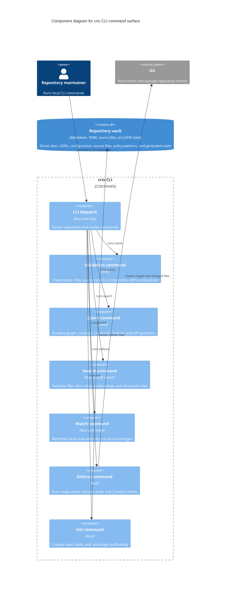
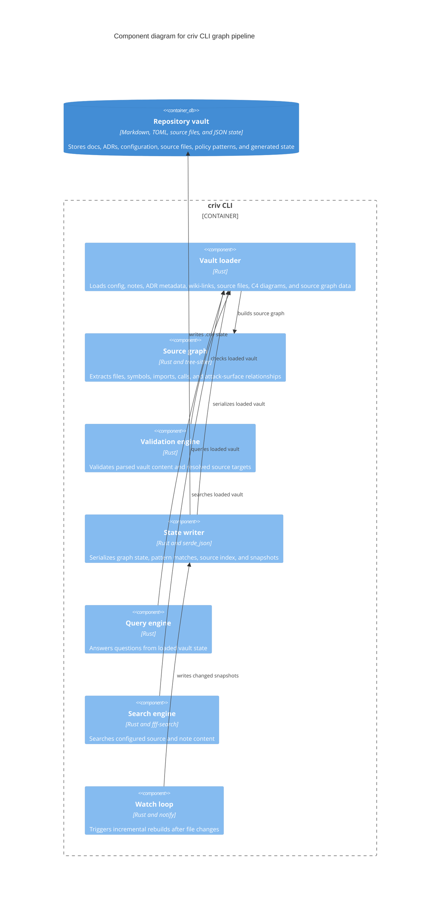
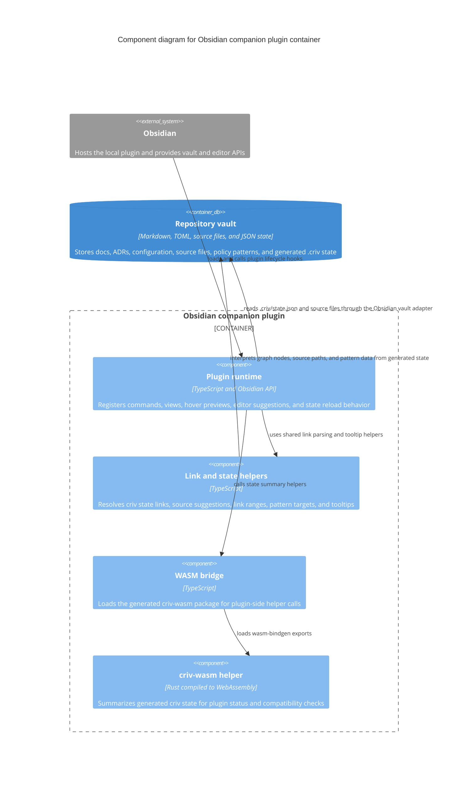

# criv Component Architecture

These C4 Level 3 views split the main containers into readable component
diagrams. The CLI is separated into command-surface and graph-pipeline views so
each diagram stays at one level of abstraction.

## CLI Command Surface

## CLI Graph Pipeline

## Obsidian Companion Plugin

